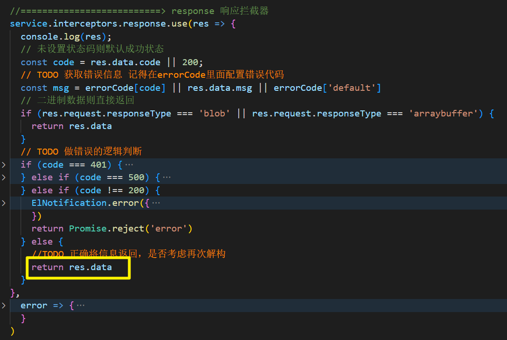

# vue3 版本管理系统胚子

```
本套胚子是基于若依管理系统vue3版本进行删减，解耦了后端逻辑，实现单纯的前端逻辑，并且使用mock完成基本的功能逻辑。
```

**环境准备：**

- node的版本在>16

- 镜像源问题：

  ```js
  npm config get registry   // 查看镜像源  淘宝源 https://registry.npmmirror.com/
  ```

  ```js
  npm config set registry https://registry.npmmirror.com/    // 设置淘宝镜像源
  ```

  

## 1、技术栈

```
vue3 + vue-router4 + element-plus + pinia + vite
```


## 2、mock配置介绍

- mock是什么： 当后端还没有把接口写好的时候，我们可以使用mock来模拟后端返回数据
- 使用了`vite-plugin-mock`的插件，可以给我们起一个`mock服务器`

- 在`vite`中如何使用`mock`

  - 安装 `mock`和  `vite-plugin-mock` 插件

  - 在`vite.config.js`中配置

    ```js
    import { UserConfigExport, ConfigEnv } from 'vite'
    
    import { viteMockServe } from 'vite-plugin-mock'
    import vue from '@vitejs/plugin-vue'
    
    export default ({ command }: ConfigEnv): UserConfigExport => {
      return {
        plugins: [
          vue(),
          // vite-plugin-mock 配置
          viteMockServe({
            // default
            mockPath: 'mock',
            localEnabled: command === 'serve',
          }),
        ],
      }
    }
    ```

    **本套胚子里面把所有的插件抽离到 `vite/plugins`目录下面做了集中的配置。**

  - 在项目根目录创建一个`mock`文件夹，里面就是我们的`mock`数据模拟文件

    - `index.js`文件

      ```js
      // 导入各个模块的mock配置
      import user from './user'
      
      // 集中暴露
      export default [
        ...user
      ]
      ```

    - `user.js`文件

      ```js
      const tokens = {
        admin: {
          token: "admin-token",
        },
        lisi: {
          token: "lisi-token",
        },
      };
      // 用户资料，张三的用户资料，李四的用户资料
      const users = {
        "admin-token": {
          introduction: "我是超级管理员",
          avatar:
            "https://wpimg.wallstcn.com/f778738c-e4f8-4870-b634-56703b4acafe.gif",
          name: "admin张三",
          roles: {
            // menuList是服务端返回动态路由配置
            menuList: [
              {
                path: "/content",
                component: "layout",
                meta: {
                  title: "内容管理",
                  icon: "dashboard",
                },
                name: "content",
                redirect: "/content/cate",
                children: [
                  {
                    path: "cate",
                    component: "content/cate",
                    name: "cate",
                    meta: {
                      title: "分类管理",
                      icon: "dashboard",
                    }
                  },
                  {
                    path: "tag",
                    component: "content/tag",
                    name: "tag",
                    meta: {
                      title: "标签管理",
                      icon: "dashboard",
                    }
                  },
                ],
              },
              {
                path: "/adv",
                component: "layout",
                meta: {
                  icon: "dashboard",
                  title: "广告管理",
                },
                name: "adv",
                redirect: "/adv/pos",
                children: [
                  {
                    path: "pos",
                    component: "adv/pos",
                    name: "pos",
                    meta: {
                      title: "广告位管理",
                      icon: "dashboard",
                    }
                  },
                  {
                    path: "img",
                    component: "adv/img",
                    name: "img",
                    meta: {
                      title: "广告图管理",
                      icon: "dashboard",
                    }
                  },
                ],
              },
            ],
            btnList: [],
          },
        },
        "lisi-token": {
          introduction: "我是广告管理员",
          avatar:
            "https://wpimg.wallstcn.com/f778738c-e4f8-4870-b634-56703b4acafe.gif",
          name: "李四",
          roles: {
            // menuList服务端返回动态路由配置
            menuList: [
              {
                path: "/content",
                component: "layout",
                title: "内容管理",
                icon: "dashboard",
                name: "content",
                redirect: "/content/cate",
                children: [
                  {
                    path: "cate",
                    component: "content/cate",
                    name: "cate",
                    meta: {
                      title: "分类管理",
                      icon: "dashboard",
                    }
                  },
                ],
              },
              {
                path: "/adv",
                component: "layout",
                meta: {
                  icon: "dashboard",
                  title: "广告管理",
                },
                name: "adv",
                redirect: "/adv/pos",
                children: [
                  {
                    path: "pos",
                    component: "adv/pos",
                    name: "pos",
                    meta: {
                      title: "广告位管理",
                      icon: "dashboard",
                    }
                  },
                ],
              },
            ],
            btnList: [],
          },
        },
      };
      ////////////////////////////////////暴露内容/////////////////////////////////////////////
      module.exports = [
        // 登录操作
        {
          url: "/mock/api/user/login",
          type: "post",
          response: (config) => {
            const { username } = config.body;
            const token = tokens[username];
      
            // mock error
            if (!token) {
              return {
                code: 60204,
                message: "账号密码不正确",
              };
            }
            return {
              code: 200,
              data: token,
            };
          },
        },
      
        // 获取用户资料
        {
          url: "/mock/api/user/getInfo",
          type: "get",
          response: (config) => {
            // 从查询参数里面读取处token
            const tokenKey = config.headers.authorization; // token的值是 admin-token  lisi-token
            const info = users[tokenKey];
            // mock error
            if (!info) {
              return {
                code: 50008,
                message: "Login failed, unable to get user details.",
              };
            }
            return {
              code: 200,
              data: info,
            };
          },
        },
        // 退出
        {
          url: "/mock/api/user/logout",
          type: "post",
          response: (_) => {
            return {
              code: 200,
              data: "success",
            };
          },
        },
      ];
      
      ```

      

## 3、核心逻辑梳理

### 1、登录流程 

- 文件位置： `views/login.vue`

  ```js
  // 视图层[login.vue] ==> 状态层[pinia中 user模块]
  await userStore.login(loginForm.value);
  ```
  
- 文件位置： `store/modules/user.js`

  ```js
   state: () => ({
       token: getToken(),   // token
   }),
  ```

  ```js
   // 登录 
  async login(userInfo) {
      // 调用API下面的登录的请求方法，发起登录请求
      let res = await login(userInfo)
      // 获取到了token，设置给state
      this.token = res.data.token
      // 存储起来到本地
      setToken(res.data.token)
  },
  ```

- 文件位置： `api/login.js`

  ```js
  // 登录方法
  export function login(data) {
    return request({
      url: '/api/user/login',
      method: 'post',
      data: data
    })
  }
  ```

- 文件位置： `uitls/request.js`

  ```js
  //==========================> 创建axios实例
  const service = axios.create({
    // axios中请求配置有baseURL选项，表示请求URL公共部分
    baseURL: import.meta.env.VITE_APP_BASE_API,  // TODO: 去环境变量里面修改基准地址
    // 超时
    timeout: 10000
  })
  ```

  

- 文件位置： `.env.development`

  ```js
  # 若依管理系统/开发环境
  # TODO 修改基准地址
  VITE_APP_BASE_API = '/mock'
  ```

- 如果有跨域问题，还要去那里 `vite.config.js`中 ，**这里没有使用到**

  ```js
   proxy: {
       // https://cn.vitejs.dev/config/#server-proxy
       '/dev-api': {
           target: 'http://localhost:8080',
               changeOrigin: true,
                   rewrite: (p) => p.replace(/^\/dev-api/, '')
       }
   }
  ```

- 文件位置： `views/login.vue`

  ```js
   await userStore.login(loginForm.value);
  router.push({ path: redirect.value || '/' });  // 走这里进入主页，进入导航守卫逻辑！！！
  ```

- 视图层=>状态层=>请求层=>工具层


### 2、导航守卫和获取资料

- 核心文件`src/permission.js`

  ```js
  import router from './router'
  import { ElMessage } from 'element-plus'
  import NProgress from 'nprogress'
  import 'nprogress/nprogress.css'
  import { getToken } from '@/utils/auth'
  import { isHttp } from '@/utils/validate'
  import { isRelogin } from '@/utils/request'
  import useUserStore from '@/store/modules/user'
  import useSettingsStore from '@/store/modules/settings'
  import usePermissionStore from '@/store/modules/permission'
  
  NProgress.configure({ showSpinner: false });
  
  const whiteList = ['/login', '/auth-redirect'];
  // TODO 导航守卫逻辑，可以根据自己的项目需求修改，不建议随便改
  router.beforeEach(async (to, from, next) => {
    NProgress.start()
    // 是否有token
    if (getToken()) {
      // 有token,说明登录了
      // 设置标题
      to.meta.title && useSettingsStore().setTitle(to.meta.title)
      if (to.path === '/login') {
        // 登录了还去登录页，跳转到主页
        next({ path: '/' })
        NProgress.done()
      } else {
        // 登录了，去非登录页，放行
        // 用户资料是否存在，不存在获取一下,
        // TODO 将来这里不一定是通过name来进行判断
        if (!useUserStore().name) {
          isRelogin.show = true
          // 判断当前用户是否已拉取完user_info信息
          try {
            // 1、获取用户资料 【有权限需要处理】
            // let { roles } = await useUserStore().getInfo()
            // 2 如果项目中有权限处理要处理执行  【服务器端返回动态路由实例】
            // let accessRoutes = await usePermissionStore().generateRoutes(roles.menuList)
  
            // 1、获取用户资料 【没有权限需要处理】
            await useUserStore().getInfo()
            // 2、 如果项目没有权限要处理  【没有权限需要处理，本地配置路由】
            let accessRoutes = await usePermissionStore().localRoutes()
  
  
            // ================无论是本地配置还是服务器端返回都要动态路由都要添加到路由实例中去==================
            // 3、添加到路由实例中去，由于vue-router4已经抛弃了addRoutes方法，现在需要使用addRoute方法
            accessRoutes.forEach(route => {
              if (!isHttp(route.path)) {
                router.addRoute(route) // 动态添加可访问路由表
              }
            })
              
            next({ ...to, replace: true }) // hack方法 确保addRoutes已完成
          } catch (error) {
            console.log(error);
            // 拉取用户资料失败，退出
            await useUserStore().logOut()
            ElMessage.error(err)
            next({ path: '/' })
          }
        } else {
          // 已经有了用户资料放行
          next()
        }
      }
    } else {
      // 没有token，没有登录
      if (whiteList.indexOf(to.path) !== -1) {
        // 在免登录白名单，直接进入
        next()
      } else {
        next(`/login?redirect=${to.fullPath}`) // 否则全部重定向到登录页
        NProgress.done()
      }
    }
  })
  
  router.afterEach(() => {
    NProgress.done()
  })
  
  ```

- 核心文件`src/store/modules/user.js`

  ```js
   // 获取用户信息
  async getInfo() {
      let res = await getInfo()
      // .....
  },
  ```

- 文件位置： `api/login.js`

  ```js
  // 获取用户详细信息
  export function getInfo() {
    return request({
      url: '/api/user/getInfo',
      method: 'get'
    })
  }
  ```

- 文件位置： `uitls/request.js`

  ```js
  //==========================> request 请求拦截器
  service.interceptors.request.use(config => {
    // .....
    if (getToken() && !isToken) {
      // TODO： Authorization字段要根据后端来修改；
      config.headers['Authorization'] = getToken() // 让每个请求携带自定义token 请根据实际情况自行修改
    }
    // .....
    return config
  }, error => {
    console.log(error)
    Promise.reject(error)
  })
  ```

- 核心文件`src/store/modules/user.js`

  ```js
  state: () => ({
      // ...
      // TODO： 这里可能会定义成一个对象userInfo，收集很多的用户资料
      name: '', // 用户名
      avatar: '',  // 用户头像
  }),
  ```

  ```js
  // 获取用户信息
  async getInfo() {
      // ...
      this.name = res.data.name
      this.avatar = res.data.avatar
      return res.data  // 这里返回了数据==>完成权限的操作
  },
  ```

  

### 3、路由和权限问题

- 路由文件

  ```js
  // 公共路由
  export const constantRoutes = [
    {
      path: '/redirect',
      component: Layout,
      hidden: true,
      children: [
        {
          path: '/redirect/:path(.*)',
          component: () => import('@/views/redirect/index.vue')
        }
      ]
    },
    {
      path: '/login',
      component: () => import('@/views/login'),
      hidden: true
    },
    // vue-router 4.x  通配符配置是如下配置不在是 *
    {
      path: "/:pathMatch(.*)*",
      component: () => import('@/views/error/404'),
      hidden: true
    },
    {
      path: '/401',
      component: () => import('@/views/error/401'),
      hidden: true
    },
    {
      path: '',
      component: Layout,
      redirect: '/index',
      children: [
        {
          path: '/index',
          component: () => import('@/views/index'),
          name: 'Index',
          meta: { title: '首页', icon: 'dashboard', affix: true }
        }
      ]
    }
  ]
  
  // 动态路由，基于用户权限动态去加载
  export const dynamicRoutes = [
    {
      path: "/content",
      component: Layout,
      meta: {
        title: "内容管理",
        icon: "dashboard",
      },
      name: "content",
      redirect: "/content/cate",
      children: [
        {
          path: "cate",
          component: () => import('@/views/content/cate'),
          name: "cate",
          meta: {
            title: "分类管理",
            icon: "dashboard",
          }
        },
        {
          path: "tag",
          component: () => import('@/views/content/tag'),
          name: "tag",
          meta: {
            title: "标签管理",
            icon: "dashboard",
          }
        },
      ],
    },
    {
      path: "/adv",
      component: Layout,
      meta: {
        icon: "dashboard",
        title: "广告管理",
      },
      name: "adv",
      redirect: "/adv/pos",
      children: [
        {
          path: "pos",
          component: () => import('@/views/adv/pos'),
          name: "pos",
          meta: {
            title: "广告位管理",
            icon: "dashboard",
          }
        },
        {
          path: "img",
          component: () => import('@/views/adv/img'),
          name: "img",
          meta: {
            title: "广告图管理",
            icon: "dashboard",
          }
        },
      ],
    },
  ]
  
  // 创建路由实例
  const router = createRouter({
    history: createWebHashHistory(),
    routes: [...constantRoutes],  // 只挂载了静态路由
    scrollBehavior(to, from, savedPosition) {
      if (savedPosition) {
        return savedPosition
      } else {
        return { top: 0 }
      }
    },
  });
  ```

- 路由和侧边栏的关系

  本项目中由于侧边栏比较复杂，关联了侧边栏显示顶部菜单显示，核心处理逻辑在`store/modules/permission.js`中

- **如果项目中没有权限需要处理**

  - 在`src/permission.js`中，执行下列逻辑

    ```js
    // 1、获取用户资料 【没有权限需要处理】
    await useUserStore().getInfo()
    // 2、 如果项目没有权限要处理  【没有权限需要处理，本地配置路由】
    let accessRoutes = await usePermissionStore().localRoutes()
    
    // ================无论是本地配置还是服务器端返回都要动态路由都要添加到路由实例中去==================
    // 3、添加到路由实例中去，由于vue-router4已经抛弃了addRoutes方法，现在需要使用addRoute方法
    accessRoutes.forEach(route => {
        if (!isHttp(route.path)) {
            router.addRoute(route) // 动态添加可访问路由表
        }
    })
    next({ ...to, replace: true }) // hack方法 确保addRoutes已完成
    ```

  - `src/stores/modules/permission.js`中

    ```js
    import router, { 
        // ...
        dynamicRoutes 
    } from '@/router'
    ```

    ```js
    //【项目没有权限需要处理】 如果项目没有权限处理的必要，则执行这个方法。将动态路由配置给侧边栏菜单，且添加到路由实例中去
    // 注意：
    // 疑惑：可能有疑惑为什么不直接在router/index.js中直接把动态路由挂载进去，非要这里操作。
    // 解答：原因是为了配合框架的侧边栏菜单显示，侧边栏还有头部菜单设置都是在本仓库中完成的，而非读取路由的初始配置信息
    localRoutes() {
        // 顶部标签页和右上角搜索用的数据
        this.setRoutes(dynamicRoutes)
        // 设置侧边栏菜单数据
        this.setSidebarRouters(constantRoutes.concat(dynamicRoutes))
        // 设置给setting组件的数据
        this.setDefaultRoutes(dynamicRoutes)
        // 设置顶部菜单数据
        this.setTopbarRoutes(dynamicRoutes)
        // 返回用户的动态路由标识
        return dynamicRoutes
    }
    ```

- **如果项目中有页面权限需要处理**\

  - 配置规则：权限采用服务端返回动态路由的方式，有2个注意点需要调整

    - 1、子级路由配置，不需要带上上级前缀

      ```js
      {
      	path: "/content",
          name:'content',
          component:"组件对象/组件路径的字符串",
          redirect:'/content/cate',
          meta:{ title:"xx", icon:"xx" },
          children: [
           {
              path: "cate", 
              // 这里必须不要带上级，不能以/开头因为侧边栏前端代码处理的时候，会自动带上上级前缀是 /content/cate
              // 其他... 
            },
          ],
      },
      ```


    - 2、服务端返回的组件字符串路径必须和前端文件夹的路径完全一致，精确到除了`.vue`都要一样。

      ```js
      如： 
      	服务器端返回组件路径 "/content/adv/img" 那么前端必须有文件是： "/content/adv/img.vue" 不能是  "/content/adv/img/index.vue"
      ```


  - 在`src/permission.js`中，执行下列逻辑

    ```js
    // 1、获取用户资料 【有权限需要处理】
    let { roles } = await useUserStore().getInfo()
    // 2 如果项目中有权限处理要处理执行  【服务器端返回动态路由实例】
    let accessRoutes = await usePermissionStore().generateRoutes(roles.menuList)
    
     // ================无论是本地配置还是服务器端返回都要动态路由都要添加到路由实例中去==================
    // 3、添加到路由实例中去，由于vue-router4已经抛弃了addRoutes方法，现在需要使用addRoute方法
    accessRoutes.forEach(route => {
        if (!isHttp(route.path)) {
            router.addRoute(route) // 动态添加可访问路由表
        }
    })
    next({ ...to, replace: true }) // hack方法 确保addRoutes已完成
    ```

  - `src/stores/modules/permission.js`中

    ```js
    //【项目有RBAC权限需要处理】 整理服务器端返回的路由  【核心难点方法！】
    generateRoutes(menuList) {
        // 数据拷贝，防止污染
        const sdata = JSON.parse(JSON.stringify(menuList))
        const rdata = JSON.parse(JSON.stringify(menuList))
        // 默认数据
        const defaultData = JSON.parse(JSON.stringify(menuList))
        // 侧边栏菜单数据
        const sidebarRoutes = filterAsyncRouter(sdata)
        // 重写路由数据（需要挂载的路由实例上的返回的用户的动态路由，核心！）
        const rewriteRoutes = filterAsyncRouter(rdata, false, true)
        // 顶部菜单数据
        const defaultRoutes = filterAsyncRouter(defaultData)
        // 顶部标签页和右上角搜索用的数据
        this.setRoutes(rewriteRoutes)
        // 设置侧边栏菜单数据
        this.setSidebarRouters(constantRoutes.concat(sidebarRoutes))
        // 设置给setting组件的数据
        this.setDefaultRoutes(sidebarRoutes)
        // 设置顶部菜单数据
        this.setTopbarRoutes(defaultRoutes)
        // 返回用户的动态路由标识
        return rewriteRoutes
    },
    ```
